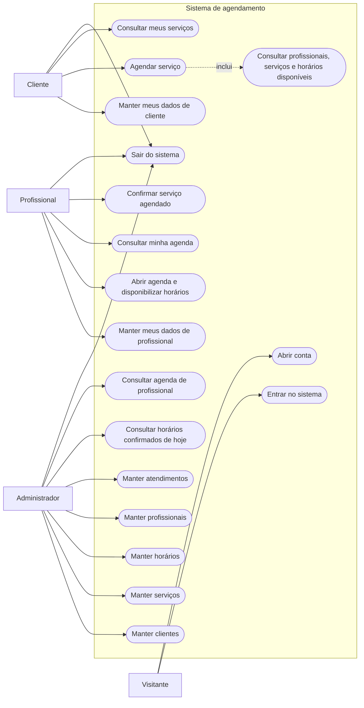

## Diagrama de casos de uso

```mermaid
flowchart LR
    Visitante[Visitante]
    Cliente[Cliente]
    Profissional[Profissional]
    Admin[Administrador]

    subgraph Sistema["Sistema de agendamento"]
        UCEntrar([Entrar no sistema])
        UCCriarConta([Abrir conta])
        UCSair([Sair do sistema])

        UCPerfilCliente([Manter meus dados de cliente])
        UCAgendar([Agendar serviço])
        UCDisponibilidade([Consultar profissionais, serviços e horários disponíveis])
        UCMeusServicos([Consultar meus serviços])

        UCPerfilProfissional([Manter meus dados de profissional])
        UCAbrirAgenda([Abrir agenda e disponibilizar horários])
        UCVerAgenda([Consultar minha agenda])
        UCConfirmar([Confirmar serviço agendado])

        UCCrudClientes([Manter clientes])
        UCCrudServicos([Manter serviços])
        UCCrudHorarios([Manter horários])
        UCCrudProfissionais([Manter profissionais])
        UCCrudAtendimentos([Manter atendimentos])
        UCHoje([Consultar horários confirmados de hoje])
        UCAgendaProfissional([Consultar agenda de profissional])
    end

    Visitante --> UCEntrar
    Visitante --> UCCriarConta

    Cliente --> UCPerfilCliente
    Cliente --> UCAgendar
    Cliente --> UCMeusServicos
    Cliente --> UCSair
    UCAgendar -.->|inclui| UCDisponibilidade

    Profissional --> UCPerfilProfissional
    Profissional --> UCAbrirAgenda
    Profissional --> UCVerAgenda
    Profissional --> UCConfirmar
    Profissional --> UCSair

    Admin --> UCCrudClientes
    Admin --> UCCrudServicos
    Admin --> UCCrudHorarios
    Admin --> UCCrudProfissionais
    Admin --> UCCrudAtendimentos
    Admin --> UCHoje
    Admin --> UCAgendaProfissional
    Admin --> UCSair
```
## Diagrama de classes

```mermaid
classDiagram
    direction TB

    namespace Dominio {
        class Cliente {
            id
            nome
            email
            fone
            senha
            +to_json()
            +from_json(dic)
        }
        class Servico {
            id
            descricao
            valor
            +to_json()
            +from_json(dic)
        }
        class Profissional {
            id
            nome
            email
            especialidade
            senha
            +to_json()
            +to_dict()
            +from_json(dic)
        }
        class Horario {
            id
            data
            confirmado
            id_cliente
            id_servico
            id_profissional
            +to_json()
            +from_json(dic)
        }
        class Atendimento {
            id
            data
            queixa_principal
            historico_saude
            avaliacao
            prescricao
            id_horario
            +to_json()
            +from_json(dic)
        }
    }

    namespace InterfaceUsuario {
        class IndexUI {
            +main()
            +sidebar()
            +menu_visitante()
            +menu_cliente()
            +menu_profissional()
            +menu_admin()
            +sair_do_sistema()
        }
        class LoginUI {
            +main()
        }
        class AbrirContaUI {
            +main()
        }
        class PerfilClienteUI {
            +main()
        }
        class AgendarServicoUI {
            +main()
        }
        class VisualizarMeusServicosUI {
            +main()
        }
        class PerfilProfissionalUI {
            +main()
        }
        class AbrirMinhaAgendaUI {
            +main()
        }
        class VisualizarMinhaAgendaUI {
            +main()
        }
        class ConfirmarServicoUI {
            +main()
        }
        class ManterClienteUI {
            +main()
            +listar()
            +inserir()
            +atualizar()
            +excluir()
        }
        class ManterServicoUI {
            +main()
            +listar()
            +inserir()
            +atualizar()
            +excluir()
        }
        class ManterHorarioUI {
            +main()
            +listar()
            +inserir()
            +atualizar()
            +excluir()
        }
        class ManterProfissionalUI {
            +main()
            +listar()
            +inserir()
            +atualizar()
            +excluir()
        }
        class ManterAtendimentoUI {
            +main()
            +listar()
            +inserir()
            +atualizar()
            +excluir()
        }
        class ListarHorariosConfirmadosHojeUI {
            +main()
        }
        class ListarAgendaProfissionalUI {
            +main()
        }
    }

    namespace Operacoes {
        class Service {
            +cliente_inserir()
            +cliente_listar()
            +cliente_listar_id()
            +cliente_atualizar()
            +cliente_excluir()
            +cliente_criar_admin()
            +cliente_autenticar()
            +cliente_alterar_senha()
            +servico_inserir()
            +servico_listar()
            +servico_listar_id()
            +servico_atualizar()
            +servico_excluir()
            +horario_inserir()
            +horario_listar()
            +horario_listar_id()
            +horario_atualizar()
            +horario_excluir()
            +horario_listar_disponiveis()
            +horario_abrir_minha_agenda()
            +horario_visualizar_minha_agenda()
            +horario_listar_agenda_profissional()
            +horario_visualizar_meus_servicos()
            +horario_listar_confirmados_hoje()
            +horario_confirmar_servico()
            +atendimento_inserir()
            +atendimento_listar()
            +atendimento_listar_id()
            +atendimento_atualizar()
            +atendimento_excluir()
            +profissional_inserir()
            +profissional_listar()
            +profissional_listar_id()
            +profissional_atualizar()
            +profissional_excluir()
            +profissional_autenticar()
        }
    }

    namespace Persistencia {
        class DAO {
            <<abstract>>
            +abrir()
            +salvar()
            +inserir(obj)
            +listar()
            +listar_id(id)
            +atualizar(obj)
            +excluir(id)
        }
        class ClienteDAO {
            +inserir(obj)
            +listar()
            +listar_id(id)
            +atualizar(obj)
            +excluir(id)
            -abrir()
            -salvar()
        }
        class ServicoDAO {
            +abrir()
            +salvar()
        }
        class ProfissionalDAO {
            +abrir()
            +salvar()
        }
        class HorarioDAO {
            +abrir()
            +salvar()
        }
        class AtendimentoDAO {
            +abrir()
            +salvar()
        }
    }

    Cliente "1" <-- "0..*" Horario : id_cliente
    Servico "1" <-- "0..*" Horario : id_servico
    Profissional "1" <-- "0..*" Horario : id_profissional
    Horario "1" <-- "0..*" Atendimento : id_horario

    DAO <|-- ServicoDAO
    DAO <|-- ProfissionalDAO
    DAO <|-- HorarioDAO
    DAO <|-- AtendimentoDAO
    ClienteDAO ..> Cliente : serializa
    ServicoDAO ..> Servico : serializa
    ProfissionalDAO ..> Profissional : serializa
    HorarioDAO ..> Horario : serializa
    AtendimentoDAO ..> Atendimento : serializa

    IndexUI ..> LoginUI
    IndexUI ..> AbrirContaUI
    IndexUI ..> PerfilClienteUI
    IndexUI ..> AgendarServicoUI
    IndexUI ..> VisualizarMeusServicosUI
    IndexUI ..> PerfilProfissionalUI
    IndexUI ..> AbrirMinhaAgendaUI
    IndexUI ..> VisualizarMinhaAgendaUI
    IndexUI ..> ConfirmarServicoUI
    IndexUI ..> ManterClienteUI
    IndexUI ..> ManterServicoUI
    IndexUI ..> ManterHorarioUI
    IndexUI ..> ManterProfissionalUI
    IndexUI ..> ManterAtendimentoUI
    IndexUI ..> ListarHorariosConfirmadosHojeUI
    IndexUI ..> ListarAgendaProfissionalUI

    LoginUI ..> Service
    AbrirContaUI ..> Service
    PerfilClienteUI ..> Service
    AgendarServicoUI ..> Service
    VisualizarMeusServicosUI ..> Service
    PerfilProfissionalUI ..> Service
    AbrirMinhaAgendaUI ..> Service
    VisualizarMinhaAgendaUI ..> Service
    ConfirmarServicoUI ..> Service
    ManterClienteUI ..> Service
    ManterServicoUI ..> Service
    ManterHorarioUI ..> Service
    ManterProfissionalUI ..> Service
    ManterAtendimentoUI ..> Service
    ListarHorariosConfirmadosHojeUI ..> Service
    ListarAgendaProfissionalUI ..> Service

    Service ..> ClienteDAO
    Service ..> ServicoDAO
    Service ..> ProfissionalDAO
    Service ..> HorarioDAO
    Service ..> AtendimentoDAO
```